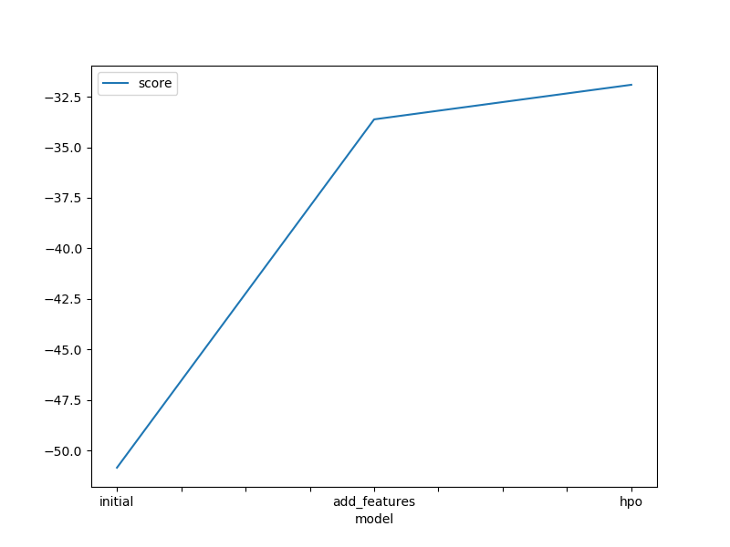
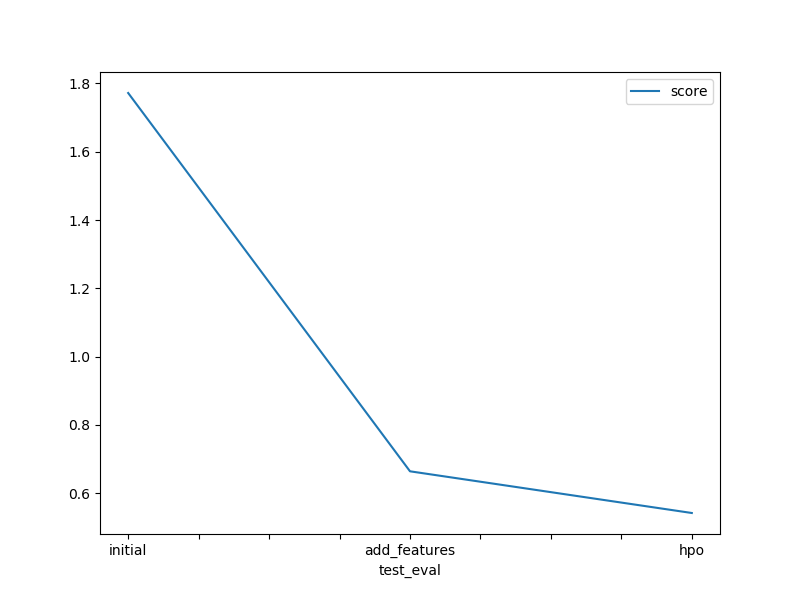

# Report: Predict Bike Sharing Demand with AutoGluon Solution
#### NAME HERE

## Initial Training
### What did you realize when you tried to submit your predictions? What changes were needed to the output of the predictor to submit your results?
TODO: Had to check if any negative values are present in the output of the predictor, if there are any have to convert them to 0. Then the output of predictor is of type <pandas.series>, to submit, it must be in the form of a dataframe. SO had to set the result to dataframe and then sub,it it.

### What was the top ranked model that performed?
TODO: WeightedEnsemble_L3 was the top ranked model that performed.

## Exploratory data analysis and feature creation
### What did the exploratory analysis find and how did you add additional features?
TODO: Through EDA we found distribution of each one relative to the data, season and weather can be treated as categories. I added features hour,day and month by splitting datetime

### How much better did your model preform after adding additional features and why do you think that is?
TODO: There was significant growth of model performance after adding additional features as score changed from 1.7 to 0.66. It can happen because the model can capture time-dependent patterns and enhanced feature representation.

## Hyper parameter tuning
### How much better did your model preform after trying different hyper parameters?
TODO: The score changed from 0.66 to 0.54.

### If you were given more time with this dataset, where do you think you would spend more time?
TODO: I would have spent more time with exploratory data analysis by checking distributions, correlations and looking for adding additional features and then on hyperparameter tuning. The hyperparameter tuning takes long time as for change of any combination the model has to be trained and evaluated again.

### Create a table with the models you ran, the hyperparameters modified, and the kaggle score.
|----model---|time_limit|infer_limit|--------presets--------|score|
|------------|----------|-----------|-----------------------|-----|
|--initial---|----600---|---None----|-----best_quality------|1.772|
|add_features|----600---|---None----|-----best_quality------|0.663|
|----hpo-----|---1500---|---0.02----|optimize_for_deployment|0.541|

### Create a line plot showing the top model score for the three (or more) training runs during the project.

TODO: Replace the image below with your own.

### Create a line plot showing the top kaggle score for the three (or more) prediction submissions during the project.

TODO: Replace the image below with your own.

## Summary
TODO: Through this project i have known how exploratory data analysis helps in gaining insights about the data, guiding preprocessing and feature engineering decisions, while hyperparameter tuning optimizes the model's configuration for better performance. These steps work together to create an improved model that utilizes the dataset's information effectively and enhances its predictive capabilities.